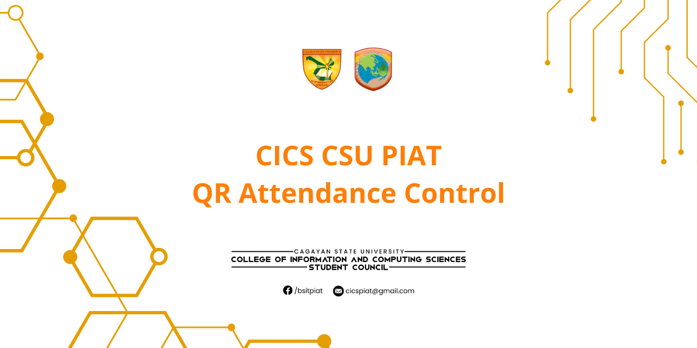
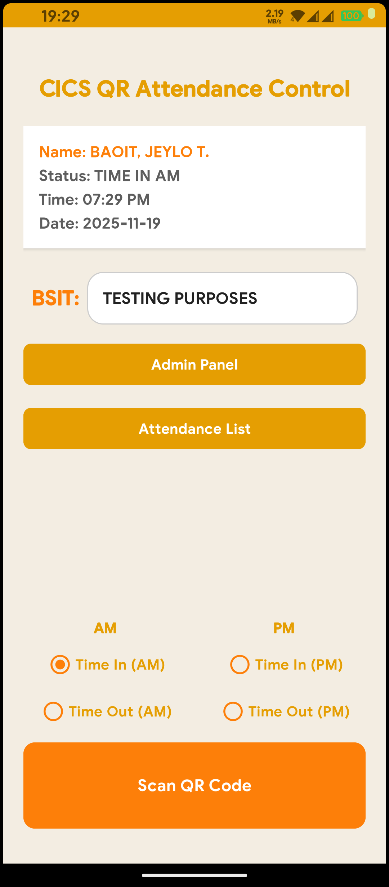
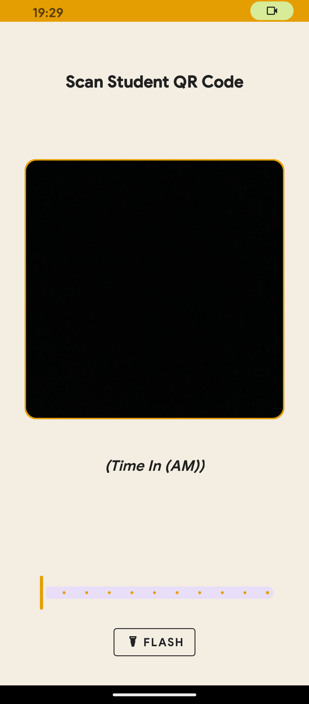
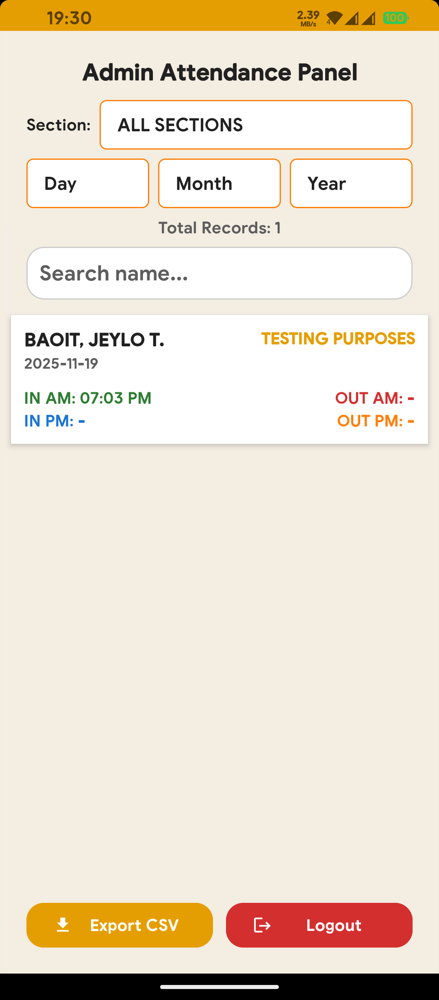
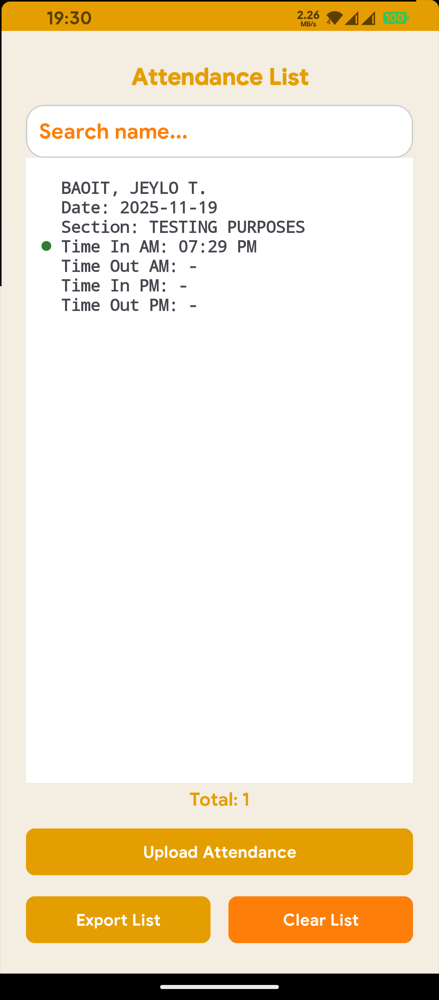
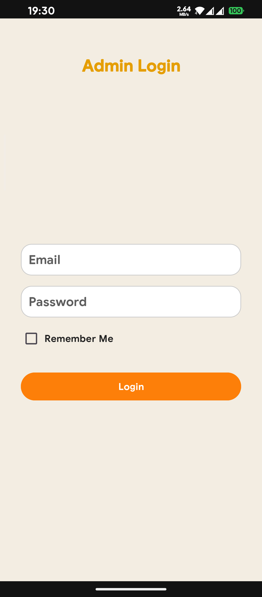

  

<h1 align="center">CICS QR Attendance Control</h1>

  A smart, offline-first Android application designed to streamline student attendance using QR technology, real-time analytics, and cloud synchronization.

  
  
  

---

## 🚀 Latest Updates

### ✨ V6.1 (Current - Enhanced Reliability & Performance)
- **🔧 Improved Sync Engine:** More reliable offline-to-cloud synchronization with better error handling.
- **📊 Enhanced Analytics:** Refined graph calculations for more accurate attendance statistics.
- **🎯 Camera Controls Polish:** Zoom slider and flash toggle refined for better scanning experience.
- **🛡️ ProGuard Optimization:** Release builds now fully minified with no reflection issues.

### 🆕 V6.0 (NFC Integration)
- **📶 Dedicated RFID/NFC Screen:** Focused RFID scanner with continuous scanning support.
- **🪪 Contactless Attendance:** NFC card reading and parsing for tap-based check-ins.
- **🧠 Safer Attendance Logic:** QR and RFID share normalized ID handling to prevent duplicate records.
- **🎨 UI Polish:** Refined scanner visuals and improved UX consistency.

---

## ✨ Core Features

### 📱 For Attendance Taking
- **Dual Scanning Modes:** QR codes (CameraX + ML Kit) or NFC/RFID cards for flexible check-ins.
- **Smart Logic:** Automatically detects and prevents duplicate scans (5-second window).
- **Offline-First:** Records saved to SQLite immediately—never lose data without internet.
- **Dynamic Sections:** Section lists fetched from Firebase Remote Config, updateable without app restart.
- **Camera Controls:** Zoom slider and flash toggle for optimal QR scanning in any lighting.
- **History Log:** View, search, and filter local scan logs with sync status indicators (🟢 Cloud / 🔴 Local).
- **CSV Export:** Generate and export attendance reports compatible with Excel/Google Sheets.

### 📊 Analytics & Reporting
- **Real-Time Graphs:** Visual attendance trends with MPAndroidChart integration.
- **Attendance Statistics:** Calculate present/absent/late counts by section and time period.
- **Customizable Reports:** Filter by date, section, or student for targeted analysis.

### 🔐 For Administrators
- **Secure Login:** Firebase Authentication with UID whitelisting for admin access.
- **Real-Time Sync:** Automatic upload of local records to Firestore (with visual sync status).
- **Cloud Dashboard:** View all attendance records synced from all devices in real-time.
- **Cloud Control:** Manage sections and admins remotely via Firebase Remote Config.
- **Data Management:** Search, filter, and delete records by date/section/name/ID.
- **Push Notifications:** FCM integration for attendance sync updates and alerts.

---

## 📖 How to Use

### 🧑‍🏫 For Users (Faculty/Attendance Officers)
1. **Select Section:** Choose the class section from the dropdown (dynamically loaded from Firebase).
2. **Select Time Slot:** Choose **Time In (AM/PM)** or **Time Out (AM/PM)**.
3. **Scan:** Select your preferred method:
   - **QR Code:** Tap "Scan QR Code" → Point camera at student ID
     * Format: `ID_NUMBER|STUDENT_NAME` (e.g., `2024001|Juan Dela Cruz`)
   - **NFC/RFID:** Tap "Scan RFID Card" → Hold card to device for tap-based check-in (New in v6.0+)
4. **Instant Recording:** Record saves immediately to SQLite, sync happens in background when online.
5. **View History:** Tap "Attendance History" to see all records with sync status:
   - 🟢 **Green Dot:** Synced to cloud
   - 🔴 **Red Dot:** Local only (will sync automatically when internet returns)
6. **Search & Filter:** Filter history by date, section, name, or student ID.
7. **Export:** Tap "Export CSV" to generate Excel-compatible reports for archiving or sharing.

### 🛡️ For Admins
1. **Secure Login:** Tap "Admin Panel" → Firebase Auth login → UID validation against admin whitelist.
2. **Dashboard:** Real-time view of all attendance records synced from all devices globally.
3. **Advanced Filtering:** Filter records by:
   - 📅 **Date Range:** Select year and month
   - 🏫 **Section:** Filter by specific class section
   - 👤 **Student:** Search by name, ID, or full details
4. **Data Management:** Long-press any record to delete permanently from cloud database.
5. **Configuration & Control:**
   - **Add Sections:** Update `sections_list` in Firebase Remote Config (JSON format)
   - **Manage Admins:** Add/remove admin UIDs via Firestore admin collection
   - **Changes Apply:** Restart app to load updated config instantly
6. **Analytics:** View graphs and statistics for attendance trends and patterns.

---

## 🧰 Tech Stack

| Component | Technology |
|-----------|-----------|
| **Language** | Java 17 (Android SDK) |
| **Min/Target SDK** | Android 23 / 34 |
| **Scanning** | Android CameraX + Google ML Kit Vision (QR), NFC/RFID (Tags) |
| **Database** | SQLite 3 (Local, Offline-First) + Firebase Firestore (Cloud Sync) |
| **Authentication** | Firebase Authentication + Custom UID Whitelisting |
| **Config Management** | Firebase Remote Config (Dynamic Sections) |
| **Push Notifications** | Firebase Cloud Messaging (FCM) |
| **Analytics & Graphs** | MPAndroidChart |
| **Export & Sharing** | Storage Access Framework (SAF) + FileProvider |
| **Build System** | Gradle (Kotlin DSL) with ProGuard minification (release builds) |

---

## 📦 APK Download

Click below to grab the latest version:

👉 [**Download APK from Releases**](https://github.com/NightCode101/QR_Attendance_Control/releases/latest)

---

## 🖼 Screenshots

| Main Menu                 | Scanner Interface       |
|---------------------------|-------------------------|
|  |  |
| **Admin Panel**           | **History Panel**       |
|  |  |

**Login Interface**

---

## 📧 Contact

For bugs, questions, or feedback:

**Jeylo Baoit** 
📬 [jeylodigitals@gmail.com](mailto:jeylodigitals@gmail.com)  
🌐 [Facebook Profile](https://fb.com/stc.primo)

---

## 📝 License

This project is intended for academic and educational use.  
Please ask permission if you plan to use this in commercial or institutional settings.

---

## 🙌 Contributions

Pull requests and suggestions are welcome!  
Help improve the system by opening an issue or forking the project.