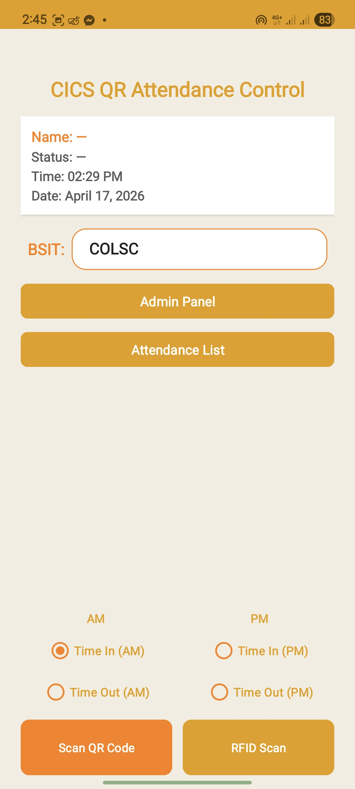
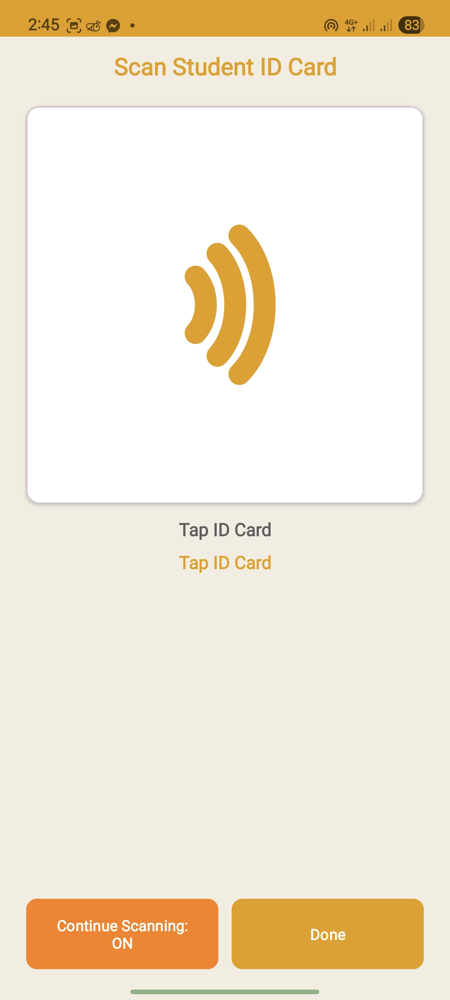
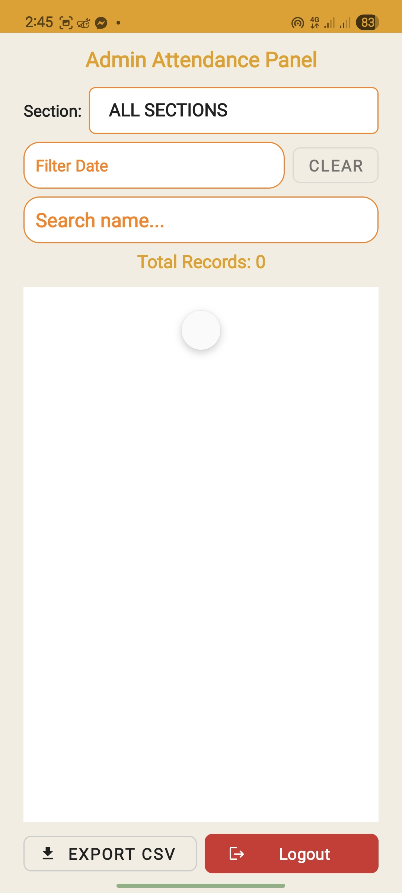

  

<h1 align="center">CICS QR Attendance Control</h1>

  A high-performance, offline-first Android application designed to streamline student attendance using QR technology, real-time analytics, and high-resiliency cloud synchronization.

  
  
  

---

## 🚀 Key v8.0.0 Updates

### 🛡️ Professional ID Validation
- **Strict Format Enforcement:** All QR and RFID scans now require the `YY-NNNNN` format (e.g., `24-06281`).
- **Instant Rejection:** Invalid codes are detected instantly in the camera view to prevent incorrect data entry.

### 📋 Absent Checker Module
- **Masterlist Comparison:** Import student lists (CSV) to identify missing students for any given date.
- **Global ID Matching:** Matches students by ID across the entire department—perfect for irregular students attending different sections.
- **Automated Reporting:** Generate professional absent reports with optimized CSV formatting.

### 🔄 High-Resiliency Sync Engine
- **Transaction-less Merge:** Robust `SetOptions.merge()` strategy ensures data is saved locally and synced automatically even on slow or unstable networks.
- **Multi-Device Support:** Different phones can scan different sessions for the same student simultaneously without data loss.

### 🚀 Maintenance & Engagement
- **App Update Checker:** Built-in GitHub API integration to check for new releases and redirect to download links directly from the menu.
- **Firebase Messaging:** Integrated In-App Messaging and Cloud Messaging for real-time announcements and admin alerts.

---

## ✨ Core Features

### 📱 For Attendance Taking
- **Dual Scanning Modes:** QR codes (CameraX + ML Kit) or NFC/RFID cards (dedicated high-speed screen).
- **Instant Offline Storage:** Records save to local SQLite immediately—zero data loss even without internet.
- **Cloud Synchronization:** Automatic background upload to Firestore with visual status indicators.

### 📊 For Administrators
- **Admin Dashboard:** Real-time view of all records synced globally. Defaults to today's date for efficiency.
- **Section Filtering:** Intelligent exclusion of administrative/test sections (e.g., "COLSC", "TESTING").
- **Professional Exports:** Generate attendance and absent reports in CSV format with student IDs as the primary column.

---

## 📖 How to Use

### 🧑‍🏫 For Users (Faculty/Attendance Officers)
1. **Select Section:** Choose the class section from the dropdown.
2. **Select Time Slot:** Choose **Time In** or **Time Out** (AM/PM).
3. **Scan:** Use QR Code or RFID. The record saves **instantly** to the phone.
4. **Sync:** Data uploads in the background. Check the status indicator (🟢 Synced / 🔴 Pending).

### 🛡️ For Admins
1. **Admin Panel:** View today's attendance logs instantly.
2. **Absent Checker:** 
   - Tap **Import List** to upload the term's student masterlist (CSV).
   - Select a date and section to see exactly who missed class.
   - Tap **Export** to generate the absent student report.
3. **Resetting:** Use **Clear List** at the end of the semester to wipe the cloud and local masterlists.

---

## 🧰 Tech Stack

 Component | Technology |
-----------|-----------|
 **Language** | Java 17 (Android SDK) |
 **Min/Target SDK** | Android 23 / 35 |
 **Database** | SQLite (Local Cache) + Firebase Firestore (Cloud Sync) |
 **Scanning** | CameraX + Google ML Kit (QR), Android NFC APIs (RFID) |
 **Communications** | Firebase In-App Messaging & Cloud Messaging |
 **Remote Control** | Firebase Remote Config |
 **Build System** | Gradle (Kotlin DSL) with ProGuard minification |

---

## 🖼 Screenshots

 Main Menu                 | Absent Checker       |
---------------------------|-------------------------|
  |  |
 **RFID Interface**        | **Admin Dashboard**       |
  |  |

---

## 📧 Contact

**Jeylo Baoit** 
📬 [jeylodigitals@gmail.com](mailto:jeylodigitals@gmail.com)  
🌐 [Facebook Profile](https://fb.com/stc.primo)

---

_Developed with ❤️ for academic efficiency and data integrity._
