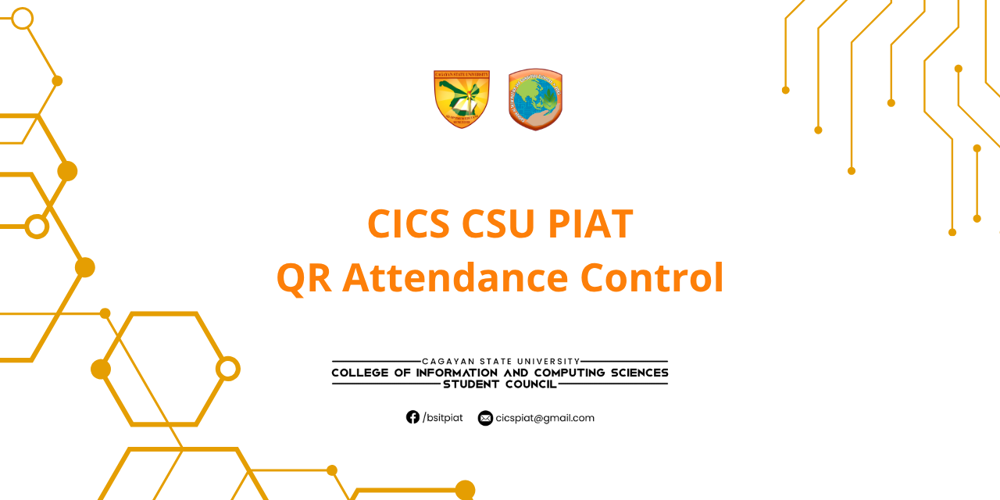

  

<h1 align="center">CICS QR Attendance Control</h1>

  A high-performance, offline-first Android application designed to streamline student attendance using QR technology, real-time analytics, and high-resiliency cloud synchronization.

  
  
  

---

## 🚀 Key v8.2.0 Updates

### 🛡️ Data Integrity & Protection
- **First-Scan Protection:** Implemented a server-side lock that prevents any scan (Time In/Out) from being overwritten once it has been recorded in the cloud.
- **Zero-Read Enforcement:** Protection is handled via Firestore Security Rules, ensuring data integrity without consuming daily Read quota.

### 📋 Stability & Optimization
- **Crash Prevention:** Resolved memory-related crashes in the Absent Checker module when performing long-press edits or deletions.
- **Flexible ID Validation:** Robust support for all student ID generations including `XX-XXXXX`, `XX-XXXX`, `XXX-XXXXX`, and `XXX-XXXX` formats.
- **Quota Saver Technology:** Advanced local caching ensures switching sections or searching costs **Zero additional Firestore reads**.

### 🔄 High-Resiliency Sync Engine
- **Conflict-Free Merging:** Multi-device support with protected updates ensures that scans from different phones for the same session are preserved correctly.

### ✨ Professional UI
- **Automated Filtering:** Attendance history defaults to **Today's** records, sorted alphabetically for efficiency.
- **Expandable Content:** "About" screen content is now expandable for a cleaner user experience.

---

## ✨ Core Features

### 📱 For Attendance Taking
- **Dual Scanning Modes:** QR codes (CameraX + ML Kit) or NFC/RFID cards.
- **Instant Offline Storage:** Records save to local SQLite immediately—zero data loss.
- **Cloud Synchronization:** Automatic background upload to Firestore with visual status indicators.

### 📊 For Administrators
- **Absent Checker:** Masterlist comparison with global ID matching and session filtering.
- **Professional Exports:** Generate attendance and absent reports in CSV format.
- **App Update Checker:** Built-in GitHub integration for seamless maintenance.

---

## 🧰 Tech Stack

 Component | Technology |
-----------|-----------|
 **Language** | Java 17 (Android SDK) |
 **Database** | SQLite (Local Cache) + Firebase Firestore (Cloud Sync) |
 **Scanning** | CameraX + Google ML Kit (QR), Android NFC APIs (RFID) |
 **Build System** | Gradle (Kotlin DSL) with ProGuard minification |

---

## 📧 Contact

**Jeylo Baoit** 
📬 [jeylodigitals@gmail.com](mailto:jeylodigitals@gmail.com)  
🌐 [Facebook Profile](https://fb.com/stc.primo)

---

_Developed with ❤️ for academic efficiency and data integrity._
